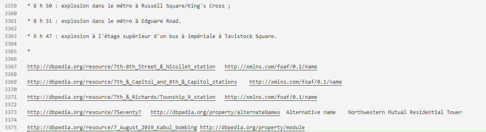

# Additional Information

## duplicates and outlier 

|   Data Sources   | Number of raw data | Number of incomplete data | Number of duplicates | Number of final data |
| :--------------: | :----------------: | :-----------------------: | :------------------: | :------------------: |
|  DBpedia-online  |     20,974,071     |          185,185          |      3,720,087       |      17,068,799      |
| DBpedia-snapshot |    132,565,791     |          666,742          |      1,950,634       |     130,948,415      |

DBpedia-online's exception data can be seen in the file [DBpedia_online_errorLines.csv](./DBpedia_online_errorLines.csv)

DBpedia-snapshot's exception data can be seen in the file [DBpedia-snapshot_errorLines.zip](./DBpedia-snapshot_errorLines.zip)

Incomplete Data Example

---

## 17K

After data cleaning, the data we obtained does contain 17k relations, all of which are different predicates. Specific predicate information can be viewed in the file  [raw_predicate_information.csv](./raw predicate information.csv)

## S-DBpedia relationship

S-DBpedia relationships can be viewed in the file  [S-DBpedia_relationships.csv](./S-DBpedia relationships.csv)
